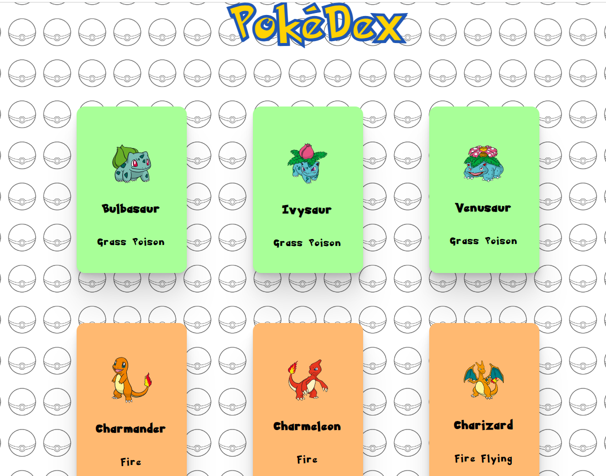

                                      # Projeto Pokedex usando PokeApi do curso Dev Quest

                                       

# Projeto PokeApi feito com React

  Este projeto foi proposto como um tipo de "Prova final" durante o curso DevQuest, lecionado por Ricardo Dias e Roberto Dias e equipe (caras incríveis). Nele foi usado todo o conhecimento
adquirido durante o curso, usando técnicas atualizadas de HTML, CSS, JavaScript e ReactJS, testando assim o meu aprendizado durante todo o curso.

# Técnicas e linguagens do projeto

   Foi utilizado dentro do ReactJS, criação de rotas React Router Dom, criação de stateless components e statefull components usando hooks como useState e useEffect, utilizei também o useContext para criar um botão que trocasse o tema da página para claro ou escuro, Axios, Styled Components dentre outras técnicas.

# Desafios encontrados

   Encontrei certa dificuldade durante a criação do porjeto para fazer a Api trazer a descrição das Abilities dos Pokemons para a tela, foi particularmente difícil esta parte, mas com uma certa paciência e trabalho em equipe com alguns colegas do curso, foi solucionado o problema, o restante foi desafiador mas divertido, o código me trouxe muito aprendizado e desafios que agregaram meus conhecimentos e me trouxeram uma nova visão da programação em si, esses conhecimentos que com certeza irei aprimorar ao longo dos meus próximos anos de estudo.

# O incrível CSS

   Na parte de CSS busquei diversas inspirações na Web, aprimorando para o meu gosto conforme fui criando os estilos. Uma coisa a se notar é que no começo desta caminhada a estilização era um ponto fraco meu, tendo dificuldade em deixar tudo mais responsivo,
no entanto, durante este projeto achei relaxante e divertida esta parte, visto a complexidade que o código me gerou, a estilização me pareceu brincadeira quando chegou o momento. Tive alguma dificuldade para fazer as cores de cada tipo de pokemon ser mostrada
ao fundo dos cards, mas foi resolvido rapidamente, pricipalmente coma ajuda de colegas que fiz ao longo do curso.
